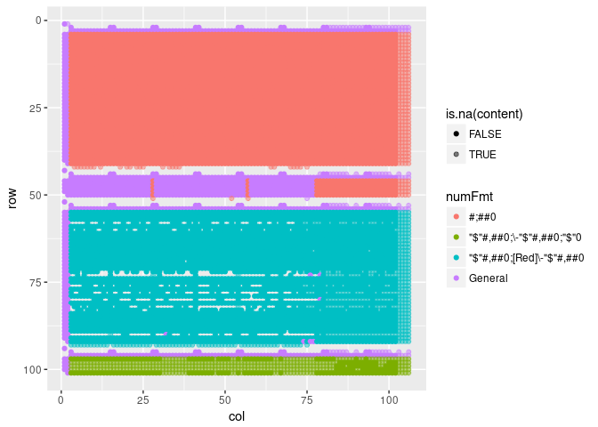
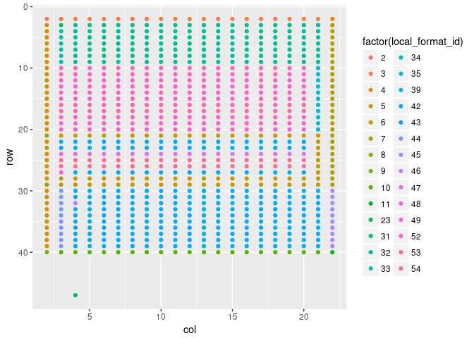

<!-- README.md is generated from README.Rmd. Please edit that file -->
goggles
=======

[](https://travis-ci.org/nacnudus/goggles) [](https://ci.appveyor.com/project/nacnudus/goggles) 

> Spreadsheets are dangerous. Wear goggles.

> `Goggles` help(s) you spot spreadsheet anomalies in the wild.

Spreadsheets are notoriously helpful in converting numbers to dates. Humans are notoriously unhelpful in overwriting formulas with literals. With goggles, you can quickly visualise possible errors.

This is basically a thin wrapper around [`tidyxl`](https://github.com/nacnudus/tidyxl) and [`unpivotr`](https://github.com/nacnudus/unpivotr) that plots cells in their positions and colours them by some property, e.g. number format.

``` r
library(tidyverse)
library(tidyxl)
library(goggles)

filepath = system.file("extdata/road-policing-driver-offence-data-jan2009-sep2006.xlsx",
                       package = "goggles")
cells <- xlsx_cells(filepath)
formats <- xlsx_formats(filepath)
sheets <- xlsx_sheet_names(filepath)

alcdrug <- filter(cells, sheet == sheets[9])
alcdrug$numFmt <- formats$local$numFmt[alcdrug$local_format_id]

ggplot(alcdrug, aes(col, row, fill = data_type, alpha = is_blank)) +
  geom_tile() +
  scale_y_reverse() +
  scale_alpha_manual(values = c(1, .5)) +
  theme(legend.position = "bottom")

ggplot(alcdrug, aes(col, row, fill = numFmt, alpha = is_blank)) +
  geom_tile() +
  scale_y_reverse() +
  scale_alpha_manual(values = c(1, .5)) +
  theme(legend.position = "bottom")
```



### CSV code injection

<!--html_preserve-->
{{&lt; tweet 921724929535545344 &gt;}}<!--/html_preserve-->

Check for executable system calls by parsing formulas with `tidyxl::xlex()`. Such calls are known as 'DDE calls'.

``` r
tidyxl::xlex("=2+5+cmd|' /C calc'!A0")
#> root                   
#> ¦-- =                  operator
#> ¦-- 2                  number
#> ¦-- +                  operator
#> ¦-- 5                  number
#> ¦-- +                  operator
#> °-- cmd|' /C calc'!A0  DDE
```
