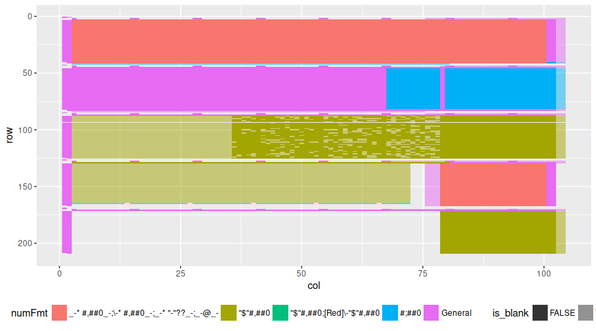

<!-- README.md is generated from README.Rmd. Please edit that file -->
goggles
=======

[](https://travis-ci.org/nacnudus/goggles) [](https://ci.appveyor.com/project/nacnudus/goggles) 

> Spreadsheets are dangerous. Wear goggles.

> `Goggles` help(s) you spot spreadsheet anomalies in the wild.

Spreadsheets are notoriously helpful in converting numbers to dates. Humans are notoriously unhelpful in overwriting formulas with literals. With goggles, you can quickly visualise possible errors.

This is basically a thin wrapper around [`tidyxl`](https://github.com/nacnudus/tidyxl) and [`unpivotr`](https://github.com/nacnudus/unpivotr) that plots cells in their positions and colours them by some property, e.g. number format.

``` r
library(tidyxl)
library(tidyverse)
#> Loading tidyverse: ggplot2
#> Loading tidyverse: tibble
#> Loading tidyverse: tidyr
#> Loading tidyverse: readr
#> Loading tidyverse: purrr
#> Loading tidyverse: dplyr
#> Conflicts with tidy packages ----------------------------------------------
#> filter(): dplyr, stats
#> lag():    dplyr, stats

x <- tidy_xlsx(system.file("extdata/road-policing-driver-offence-data-jan2009-sep2006.xlsx",
                           package = "nzpullover"))

redlight <- x$data[["Red Light"]]
redlight$numFmt <- x$formats$local$numFmt[redlight$local_format_id]

ggplot(x$data[[4]], aes(col, row,
           fill = data_type,
           alpha = is.na(content))) +
geom_tile() +
scale_y_reverse() +
scale_alpha_manual(values = c(1, .5)) +
  theme(legend.position = "bottom")

numFmts <- x$formats$local$numFmt
x$data[[4]] %>%
  mutate(numFmt = numFmts[local_format_id]) %>%
  ggplot(aes(col, row,
             fill = numFmt,
             alpha = is.na(content))) +
  geom_tile() +
  scale_y_reverse() +
  scale_alpha_manual(values = c(1, .5)) +
  theme(legend.position = "bottom")
```


